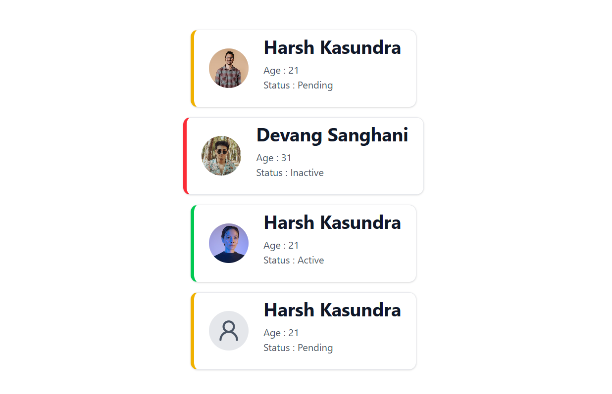

# React + TypeScript + TailwindCSS

## Task Description

Task: User Profile Card
Goal: Create a reusable card component to display basic user information.

Description:
You need to build a UserCard component using React + TypeScript with strict typing rules.

The component must display:
Name (string, required)
Age (number, required)
Status: This must only be one of "active" | "inactive" | "pending". If anything else is passed, TypeScript should give an error.

Add an optional avatarUrl (profile picture). If no picture is provided, display a default placeholder image.

Use React.FC for the component definition.

Ensure that if any required prop is missing or wrong, TypeScript shows an error (strict prop enforcement).

The status prop should visually change the color of the border (e.g., different colors border for active, inactive, pending).

## Task Output

